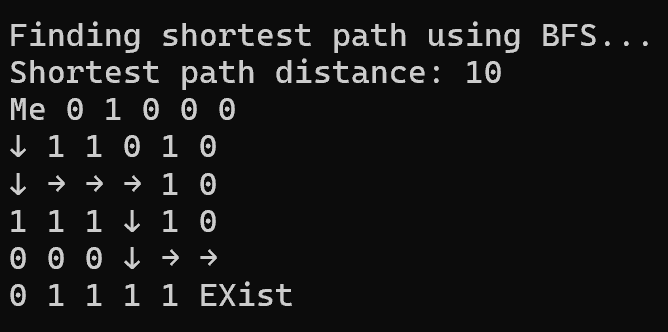
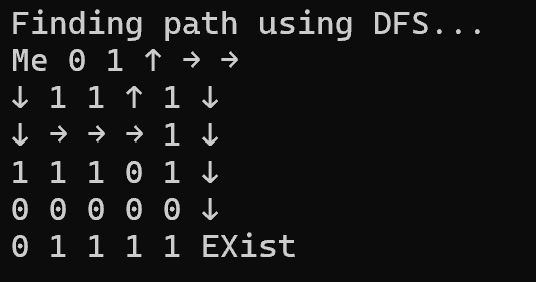

# __Fin-Tech__

## *-Safe-path code-*
***
## 1. 일반 매장 센서 코드

## 모듈 불러오기 및 gobal 변수 설정
```C
#include "Wire.h"
#include "Adafruit_ADS1015.h"
#include "DHT.h"

#define DHTPIN 2        // SDA 핀의 설정
#define DHTTYPE DHT22   // DHT22 (AM2302) 센서종류 설정
#define MAX_DATA_VALUE 600 // 온도 기록의 최대 값

Adafruit_ADS1115 ads(0x48); // ADS 모듈의 I2C 주소
DHT dht(DHTPIN, DHTTYPE); // 온/습도 센서 초기화

int16_t gas_condition = 0; // 가스센서 화재 판단을 위한 변수
int16_t temp_condition = 0; //온도센서 화재 판단을 위한 변수 
int16_t error_type = 0; // 최종 판단을 위한 변수 
						// 1이면 가스센서 이상
					    // 2이면 온도센서 이상, 3이면 종합센서 이상으로 간주 
					    // error_type을 장비의 return 값으로  

float data[MAX_DATA_VALUE]; // 온도 값을 저장하는 배열
int dataIndex = 0; //데이터 인덱스
```
## setup method
```C

void setup(void) {
  Serial.begin(115200); // 시리얼 통신 속도 설정
  for (int16_t i = 0; i < MAX_DATA_VALUE; ++i) {
    data[i] = 0;
  }
  ads.begin(); // ADS 모듈 초기화
  dht.begin(); // DHT 센서 초기화
}
```
## 1초마다 반복할 코드
```C


void loop(void) {
  int16_t CO;  // CO 일산화탄소
  int16_t NH3; // NH3 암모니아
  int16_t NO2; // NO2 이산화질소
  int16_t HCN; // HCN 시안화수소 
			   //질소를 포함한 물질
			   //(EX: 플라스틱,섬유)이 연소될 때 발생
			   
  CO = ads.readADC_SingleEnded(0); // 0번 채널
  NH3 = ads.readADC_SingleEnded(1); // 1번 채널
  NO2 = ads.readADC_SingleEnded(2); // 2번 채널
  HCN = ads.readADC_SingleEnded(3); // 3번 채널

  // 변수 별 임계치 설정
  const int16_t CO_THRESHOLD = 40;  // 일산화탄소 경보 임계치
  const int16_t NH3_THRESHOLD = 25;  // 암모니아 경보 임계치
  const int16_t NO2_THRESHOLD = 50;   // 이산화질소 경보 임계치
  const int16_t HCN_THRESHOLD = 4.7; // 시안화수소  경보 임계치

  // 출력
  Serial.print("NH3: ");
  Serial.print(NH3);
  Serial.print("\tNO2: ");
  Serial.print(NO2);
  Serial.print("\tCO: ");
  Serial.print(CO);
  Serial.print("\tHCN: ");
  Serial.println(HCN);

  gas_condition = 0; // 가스 조건 변수 초기화
  temp_condition = 0; //온도 조건 변수 초기화 
  error_type = 0; // error_type 조건 변수 초기화 
```
## __gas sensor check__
```C
  // 가스센서 이상 여부 체크
  if (CO > CO_THRESHOLD) {
    Serial.println("경고: 일산화탄소 농도가 임계치를 초과하였습니다!"); 
    gas_condition++;
  }
  if (NH3 > NH3_THRESHOLD) {
    Serial.println("경고: 암모니아 농도가 임계치를 초과하였습니다!");
    gas_condition++;
  }
  if (NO2 > NO2_THRESHOLD) {
    Serial.println("경고: 이산화질소 농도가 임계치를 초과하였습니다!");
    gas_condition++;
  }
  if (HCN > HCN_THRESHOLD) {
    Serial.println("경고: 시안화수소 농도가 임계치를 초과하였습니다!");
    gas_condition++;
  }

```
## __error_type update__
```C
//일반매장
if (gas_condition >= 3) {
    error_type = 1;
    Serial.println("가스센서 이상!");
    
  } else if (gas_condition > 0) {
    Serial.println("경고: 가스센서 이상감지! 안전위험개소를 확인하세요!");
  }
```
## __temp check__
```C
  // 센서의 온도를 읽어온다.
  float t = dht.readTemperature();

  if (isnan(t)) {
    Serial.println("온도 측정 실패");
  } else {
    Serial.println(t);
    
    // 온도 값을 배열에 저장하고 인덱스 증가
    data[dataIndex] = t;
    dataIndex = (dataIndex + 1) % MAX_DATA_VALUE;
  }
  
  average_temp = average(data, MAX_DATA_VALUE)
  
  Serial.println(average_temp);
  

  if (average_temp >= 20){

```
## __error_type update__
```C
  	//이미 가스센서의 문제가 있다면  
  	if(error_type ==1 ){
  		Serial.println("화재발생! 즉시 대피하세요!!");
  		error_type = 3; 
	  }
	//온도센서에만 문제가 있다면  
	else{
		error_type = 2;
	}
  }
  
  //최종Error_type을 이 전체 장비의  반환값으로 설정
   
  delay(1000); // 1초마다 측정
}
```
## __Average method__
```C

float average(float *array, int num_elements) {
  float sum = 0;
  for (int i = 0; i < num_elements; i++) {
    sum += array[i];
  }
  return sum / num_elements;
}

```

***
## 2. 식품코너 
>식품코너의 경우 일반 매장의 센서를 그대로 사용하면서 추가적인 가스센서를 착했습니다.
> 
> 그리고 온도를 측정하는 기준을 절대 평가 법으로 수정했습니다.
## 모듈 불러오기 및 gobal 변수 설정
```C
//version2
//주방센서 
#include "Wire.h"
#include "Adafruit_ADS1015.h"
#include "DHT.h"

#define DHTPIN 2        // SDA 핀의 설정
#define DHTTYPE DHT22   // DHT22 (AM2302) 센서종류 설정

Adafruit_ADS1115 ads(0x48); // ADS 모듈의 I2C 주소
DHT dht(DHTPIN, DHTTYPE); // 온/습도 센서 초기화

int16_t gas_condition = 0; // 가스센서 화재 판단을 위한 변수
int16_t temp_condition = 0; //온도센서 화재 판단을 위한 변수 
int16_t explo = 0; // 폭발성 여부를 확인하기 위한 변수 
int16_t error_type = 0; // 최종 판단을 위한 변수 
						// 1이면 가스센서 이상
					    // 2이면 온도센서 이상, 3이면 종합센서 이상으로 간주 
					    // error_type을 장비의 return 값으로  
```
## setup method
```C
void setup(void) {
  Serial.begin(115200); // 시리얼 통신 속도 설정, 하나의 속도만 사용
  dht.begin(); // DHT 센서 초기화
  ads.begin(); // ADS 모듈 초기화
}
```
## 1초마다 반복할 코드
```C

void loop(void) {
  gas_condition = 0; // 변수를 루프 시작 시 초기화
  temp_condition = 0; //변수를 루프 시작 시 초기화 
  error_type = 0; // 변수를 루프 시작 시 초기화
  explo = 0; // 변수를 루프 시작 시 초기화

  int16_t CO = ads.readADC_SingleEnded(1); // 1번 체널
  int16_t NH3 = ads.readADC_SingleEnded(2); // 2번 체널
  int16_t NO2 = ads.readADC_SingleEnded(3); // 3번 체널
  int16_t HCN = ads.readADC_SingleEnded(4); // 4번 체널
  int16_t C3H8 = ads.readADC_SingleEnded(5); // 5번 체널
  int16_t C4H10 = ads.readADC_SingleEnded(6); // 6번 체널

  // 변수 별 임계치 설정
  const int16_t CO_THRESHOLD = 40;
  const int16_t NH3_THRESHOLD = 25;
  const int16_t NO2_THRESHOLD = 50;
  const int16_t HCN_THRESHOLD = 4.7;
  const int16_t C3H8_THRESHOLD = 2100;
  const int16_t C4H10_THRESHOLD = 1900;

  // 출력
  Serial.print("NH3: ");
  Serial.print(NH3);
  Serial.print("\tNO2: ");
  Serial.print(NO2);
  Serial.print("\tCO: ");
  Serial.print(CO);
  Serial.print("\tHCN: ");
  Serial.print(HCN);
  Serial.print("\tC3H8: ");
  Serial.print(C3H8);
  Serial.print("\tC4H10: ");
  Serial.println(C4H10);
```
## __gas sensor check__
```C
  // 가스센서 이상 여부 체크
  if (CO > CO_THRESHOLD) {
    Serial.println("경고: 일산화탄소 농도가 임계치를 초과하였습니다!");
    gas_condition++;
  }
  if (NH3 > NH3_THRESHOLD) {
    Serial.println("경고: 암모니아 농도가 임계치를 초과하였습니다!");
    gas_condition++;
  }
  if (NO2 > NO2_THRESHOLD) {
    Serial.println("경고: 이산화질소 농도가 임계치를 초과하였습니다!");
    gas_condition++;
  }
  if (HCN > HCN_THRESHOLD) {
    Serial.println("경고: 시안화수소 농도가 폭발 위험 수치에 도달하였습니다!");
    gas_condition++;
  }
  if (C3H8 > C3H8_THRESHOLD) {
    Serial.println("경고: 프로판 농도가 폭발 위험 수치에 도달하였습니다!");
	explo++; 
  }
  if (C4H10 > C4H10_THRESHOLD) {
    Serial.println("경고: 이소부탄 농도가 폭발 위험 수치에 도달하였습니다!");
	explo++;
  }
```
## __error_type update__
```C
  //주방화재 판단 
  if(gas_condition >= 3) {
    error_type = 1;
    Serial.println("화재 발생! 대피하세요!!");
  } else if (gas_condition > 0 || explo  > 0) {
    Serial.println("가스센서 이상!위험개소를 확인하세요!");
  } 
```
## __temp check__
```C
  // 센서의 온도를 읽어온다.
  float t = dht.readTemperature();
  
  // 온도 임계값 설정
  float t_threshold = 57; // 온도 임계치

  if (isnan(t)) {
    Serial.println("온도 측정 실패");
  } else {
    Serial.print("온도: ");
    Serial.println(t);

```
## __error_type update__
```C
    if (t > t_threshold) {
      Serial.println("경고: 온도 기준치 초과");
      
      //가스센서 이상 여부 우선 확인
	  if (error_type == 1) {
	  	//가스 & 온도 둘다 문제 
	  	error_type = 3;
	  } 
	  
	  //온도센서에만 문제가 있는 경우 
	  else {
	  	error_type = 2;
	  }
    }
  }
  delay(1000); // 1초마다 측정
}


```

## 3. __작동원리__ 

각 센서에서 반환한 0또는 1을 기준으로 행렬을 생성합니다.   
```c
// 예를 들어,
    {0, 0, 1, 0, 0, 0},
    {0, 1, 1, 0, 1, 0},
    {0, 0, 0, 0, 1, 0},
    {1, 1, 1, 0, 1, 0},
    {0, 0, 0, 0, 0, 0},
    {0, 1, 1, 1, 1, 0}
```
>이 정보를 블루투스 기술을 통해 개인 장비로 전송합니다. 
>  
>개인 장비에선 BFS 알고리즘이 담긴 파일을 실행시킵니다.   

## __*BFS Algorithm*__
```c
#include <stdio.h>
#include <stdlib.h>

#define MAX 100

int N, M, i, j;
int map[MAX][MAX];
int visited[MAX][MAX];
int parent[MAX][MAX][2];

// Directions for moving in the matrix (right, down, left, up)
int dir[4][2] = {{0, 1}, {1, 0}, {0, -1}, {-1, 0}};

// Function to check if the next move is valid
int is_valid(int x, int y) {
    return (x >= 0 && x < N && y >= 0 && y < M && map[x][y] == 0 && !visited[x][y]);
}

// BFS function to find the shortest path
typedef struct {
    int x, y, dist;
} Node;

int bfs(int sx, int sy, int ex, int ey) {
    Node queue[MAX * MAX];
    int front = 0, rear = 0;

    queue[rear++] = (Node){sx, sy, 0};
    visited[sx][sy] = 1;
    parent[sx][sy][0] = -1; // To mark the starting node
    parent[sx][sy][1] = -1; // To mark the starting node

    while (front < rear) {
        Node current = queue[front++];
        int x = current.x;
        int y = current.y;
        int dist = current.dist;

        if (x == ex && y == ey) {
            return dist;
        }

        for (i = 0; i < 4; i++) {
            int nx = x + dir[i][0];
            int ny = y + dir[i][1];

            if (is_valid(nx, ny)) {
                visited[nx][ny] = 1;
                parent[nx][ny][0] = x;
                parent[nx][ny][1] = y;
                queue[rear++] = (Node){nx, ny, dist + 1};
            }
        }
    }

    return -1; // If there is no path
}

// Function to print the path using arrows
void print_path_with_arrows(int ex, int ey) {
    int x = ex;
    int y = ey;

    while (parent[x][y][0] != -1 && parent[x][y][1] != -1) {
        int px = parent[x][y][0];
        int py = parent[x][y][1];

        if (px == x - 1 && py == y) {
            map[x][y] = 2; // Down arrow
        } else if (px == x + 1 && py == y) {
            map[x][y] = 3; // Up arrow
        } else if (px == x && py == y - 1) {
            map[x][y] = 4; // Right arrow
        } else if (px == x && py == y + 1) {
            map[x][y] = 5; // Left arrow
        }

        x = px;
        y = py;
    }

    // Mark the starting point with S and the ending point with E
    map[0][0] = 6; 
    map[ex][ey] = 7;

    // Print the map with arrows
    for (i = 0; i < N; i++) {
        for (j = 0; j < M; j++) {
            if (map[i][j] == 2) {
                printf("↓ ");
            } else if (map[i][j] == 3) {
                printf("↑ ");
            } else if (map[i][j] == 4) {
                printf("→ ");
            } else if (map[i][j] == 5) {
                printf("← ");
            } else if (map[i][j] == 6) {
                printf("Me ");
            } else if (map[i][j] == 7) {
                printf("EXist ");
            } else {
                printf("%d ", map[i][j]);
            }
        }
        printf("\n");
    }
}

int main() {
    N = 6;
    M = 6;

    // Example map (0: normal, 1: abnormal)
    int example_map[6][6] = {
        {0, 0, 1, 0, 0, 0},
        {0, 1, 1, 0, 1, 0},
        {0, 0, 0, 0, 1, 0},
        {1, 1, 1, 0, 1, 0},
        {0, 0, 0, 0, 0, 0},
        {0, 1, 1, 1, 1, 0}
    };

    // Copy example_map to global map
    for (i = 0; i < N; i++) {
        for (j = 0; j < M; j++) {
            map[i][j] = example_map[i][j];
            visited[i][j] = 0;
        }
    }

    int ex = N - 1;
    int ey = M - 1;

    printf("Finding shortest path using BFS...\n");
    int distance = bfs(0, 0, ex, ey);
    if (distance == -1) {
        printf("No path found.\n");
    } else {
        printf("Shortest path distance: %d\n", distance);
        print_path_with_arrows(ex, ey);
    }

    return 0;
}

```
***
# __OutPut__
   

***
## __*DFS Algorithm*__
```c
#include <stdio.h>
#include <stdlib.h>

#define MAX 100

int N, M, i, j;
int map[MAX][MAX];
int visited[MAX][MAX];
int parent[MAX][MAX][2];

// Directions for moving in the matrix (right, down, left, up)
int dir[4][2] = {{0, 1}, {1, 0}, {0, -1}, {-1, 0}};

// Function to check if the next move is valid
int is_valid(int x, int y) {
    return (x >= 0 && x < N && y >= 0 && y < M && map[x][y] == 0 && !visited[x][y]);
}

// DFS function to find the shortest path
typedef struct {
    int x, y;
} Node;

int dfs(int sx, int sy, int ex, int ey) {
    Node stack[MAX * MAX];
    int top = -1;

    stack[++top] = (Node){sx, sy};
    visited[sx][sy] = 1;
    parent[sx][sy][0] = -1; // To mark the starting node
    parent[sx][sy][1] = -1; // To mark the starting node

    while (top >= 0) {
        Node current = stack[top--];
        int x = current.x;
        int y = current.y;

        if (x == ex && y == ey) {
            return 1; // Path found
        }

        for (i = 0; i < 4; i++) {
            int nx = x + dir[i][0];
            int ny = y + dir[i][1];

            if (is_valid(nx, ny)) {
                visited[nx][ny] = 1;
                parent[nx][ny][0] = x;
                parent[nx][ny][1] = y;
                stack[++top] = (Node){nx, ny};
            }
        }
    }

    return 0; // If there is no path
}

// Function to print the path using arrows
void print_path_with_arrows(int ex, int ey) {
    int x = ex;
    int y = ey;

    while (parent[x][y][0] != -1 && parent[x][y][1] != -1) {
        int px = parent[x][y][0];
        int py = parent[x][y][1];

        if (px == x - 1 && py == y) {
            map[x][y] = 2; // Down arrow
        } else if (px == x + 1 && py == y) {
            map[x][y] = 3; // Up arrow
        } else if (px == x && py == y - 1) {
            map[x][y] = 4; // Right arrow
        } else if (px == x && py == y + 1) {
            map[x][y] = 5; // Left arrow
        }

        x = px;
        y = py;
    }

    // Mark the starting point with S and the ending point with E
    map[0][0] = 6; 
    map[ex][ey] = 7;

    // Print the map with arrows
    for (i = 0; i < N; i++) {
        for (j = 0; j < M; j++) {
            if (map[i][j] == 2) {
                printf("↓ ");
            } else if (map[i][j] == 3) {
                printf("↑ ");
            } else if (map[i][j] == 4) {
                printf("→ ");
            } else if (map[i][j] == 5) {
                printf("← ");
            } else if (map[i][j] == 6) {
                printf("Me ");
            } else if (map[i][j] == 7) {
                printf("EXist ");
            } else {
                printf("%d ", map[i][j]);
            }
        }
        printf("\n");
    }
}

int main() {
    N = 6;
    M = 6;

    // Example map (0: normal, 1: abnormal)
    int example_map[6][6] = {
        {0, 0, 1, 0, 0, 0},
        {0, 1, 1, 0, 1, 0},
        {0, 0, 0, 0, 1, 0},
        {1, 1, 1, 0, 1, 0},
        {0, 0, 0, 0, 0, 0},
        {0, 1, 1, 1, 1, 0}
    };

    // Copy example_map to global map
    for (i = 0; i < N; i++) {
        for (j = 0; j < M; j++) {
            map[i][j] = example_map[i][j];
            visited[i][j] = 0;
        }
    }

    int ex = N - 1;
    int ey = M - 1;

    printf("Finding path using DFS...\n");
    int found = dfs(0, 0, ex, ey);
    if (!found) {
        printf("No path found.\n");
    } else {
        print_path_with_arrows(ex, ey);
    }

    return 0;
}

```
***
# __OutPut__
   

***

