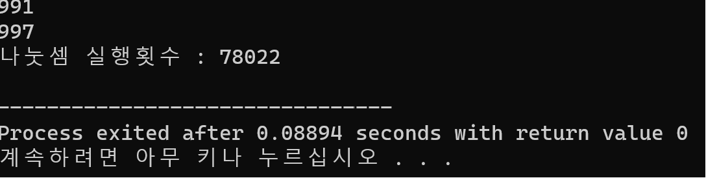

#**ICPC Report_1**  
**Tiltle : get a prime algorithm**  
**Nmae** : Kim min sang     
**Major**: Financeial mathmathics   
**number** : 202037010  

***

##**version 1**    
```
+#include <stdio.h>
int main(void)
{
	int i,n;
	unsigned long counter = 0;
	1.for(n=2;n<=1000;n++)
	{
		2.for(i=2;i<n;i++)
		{
			3.counter++;
			4.if(n%i==0)
			{
				break;
			}
		}
		5.if(n == i)
		{
			printf("%d\n",n);
		}
	}
	printf("나눗셈 실행횟수 : %d\n",counter);
	return 0;
}
```     
***

##**progress**      


***

##**Result**
     

*** 

##**coment**        
This algorithm is simple, but take many times. so inefficient.      
If we think that prime occurs in odd number set, it more efficient.
