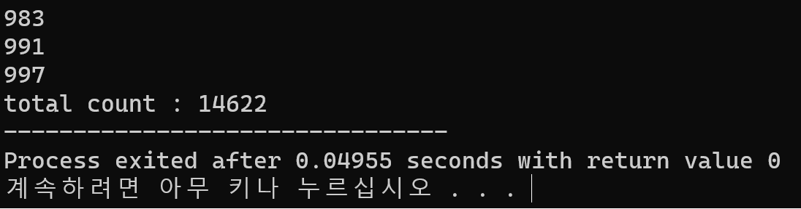

#**ICPC Report_2**  
**Tiltle : get a prime algorithm**  
**Nmae** : Kim min sang     
**Major**: Financeial mathmathics   
**number** : 202037010  

***

##**version 2**    
```
#include <stdio.h>
int main(void)
{
	int i,n;
	int prime[500];
	int ptr = 0;
	unsigned long counter = 0;
	prime[ptr++] = 2; // prime[0]=2 and ptr =1;

	for(n=3;n<=1000;n+=2)
	{
		for(i=1;i<ptr;i++)
		{
			counter++;
			if(n%prime[i]==0)
			{
				break;
			}
		}
		if(ptr == i)
		{
			prime[ptr++] = n;
		}
	}
	for(i=0;i<ptr;i++)
	{
		printf("%d\n",prime[i]);
	}
	printf("total count : %d",counter);
	return 0;
}
```     
***

##**progress**      


***

##**Result**
      

*** 

##**coment**        
This algorithm more simple than version1. But also need many calculate process. So apply square roots notion.
